# Basic infomation
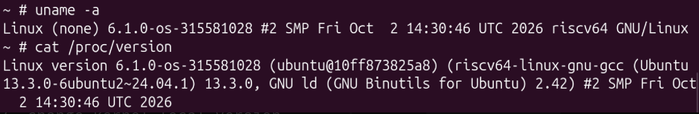

# Compiling kernel
1. `make ARCH=riscv CROSS_COMPILE=riscv64-linux-gnu- defconfig`
2. `make ARCH=riscv menuconfig`
3. change kernel local version
4. `make kernelrelease`
5. `make ARCH=riscv CROSS_COMPILE=riscv64-linux-gnu- -j$(nproc)`

# Testing
1. put testing program into `initramfs.cpio.gz` (要先解壓縮再放進去)
2. 把寫好的 program (如 `sys_revstr.c` or `sys_tempbuf.c`) 放入 linux folder (如 `/linux/kernel`)

3. compile kernel with `make ARCH=riscv CROSS_COMPILE=riscv64-linux-gnu- -j$(nproc)` 
    :::info
    run 3. in the container
    :::

4. run:
    ```    
    qemu-system-riscv64 -nographic -machine virt \
      -kernel linux/arch/riscv/boot/Image \
      -initrd initramfs.cpio.gz \
      -append "console=ttyS0 loglevel=3"
    ```
    which makes qemu have kernel image & file system
    
5. run the test program (ex: `./test_revstr`)

# Result screenshots
## `test_revstr`
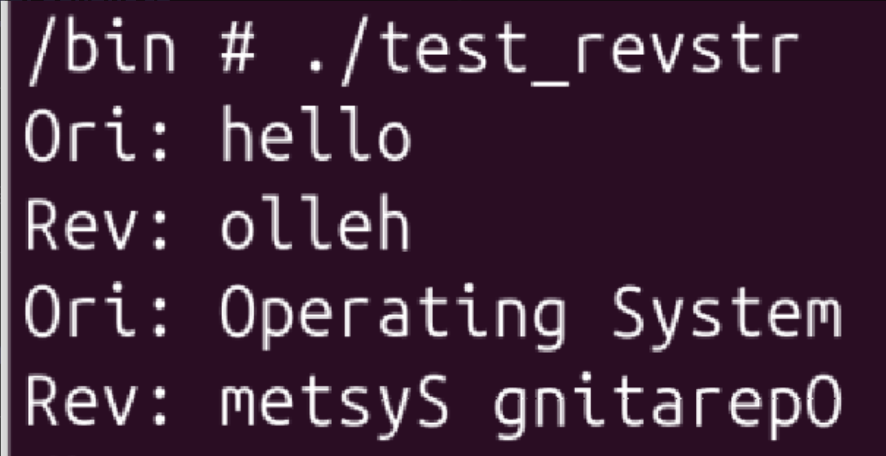

For `dmesg`:
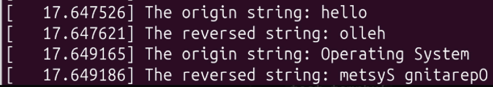

## `test_tempbuf`
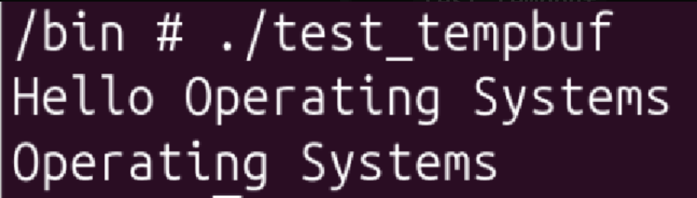

For `dmesg`:
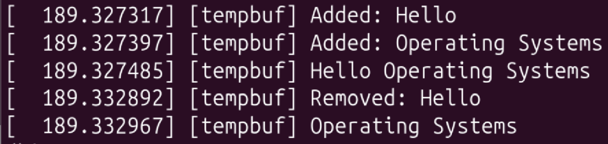


# Recording
## Prerequisite
1. 在 `include/linux/syscalls.h` 裡面寫 prototype
    :::spoiler Example:
    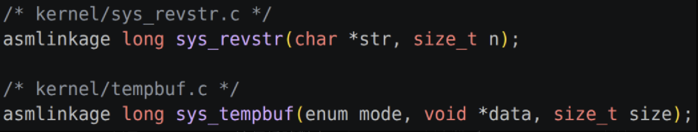
    :::

2. 在 `include/uapi/asm-generic/unistd.h` 裡面添加 system call number 以及 mapping (這個編號對應哪一個 function (prototype))
    :::spoiler Example:
    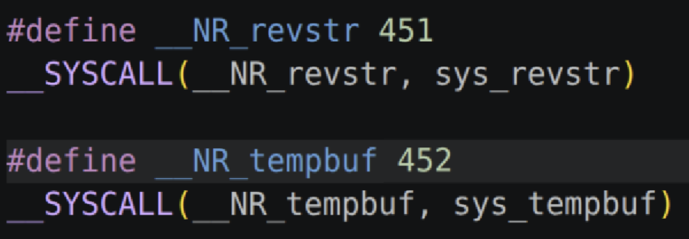

    :::

3. 在 `kernel/sys_ni.c` 加上 system call fallback (當該 system call 沒有被編入 kernel 的時候執行並回傳 -ENOSYS)
    :::info
    system call 是否需要編入 kernel is optional
    :::
    :::spoiler Example:
    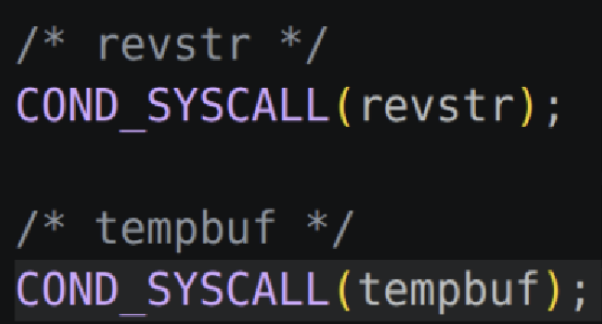
    :::

4. 在 `linux/kernel/makefile` 加上 compile `sys_revstr.c` & `sys_tempbuf.c`
    write: `obj-y += sys_revstr.o` & `obj-y += sys_tempbuf.o`
    
:::info 
**System call execution:**

kernel compile 時會把`SYSCALL_DEFINE2(revstr, ...)`裡面的`revstr` 利用 macro 擴展成 `sys_revstr`，而在`unistd.h`裡面有`__SYSCALL(451, sys_revstr)`，所以 system call table 會建立成以下:


| index | function (這個會變成右邊 address 的模樣)      |  function address   |
| ----- | --------  | --- |
| 451   | sys_revstr| 0x12345678    |

所以 user 在 userspace 執行 `syscall(__NR_revstr)` 時，kernel 會知道 `__NR_revstr` 是 451，而去 `0x12345678` 執行 `SYSCALL_DEFINE2(revstr, ...)`

::: 

# Patch
## Creation
在 `linux/` 執行 `git format-patch -1 HEAD` 即產生 patch file
## Testing
1. 查看 Patch 包含哪些檔案：
`git apply --stat 0001-Add-revstr-and-tempbuf-system-calls.patch`
2. 使用 Git 建立另一份乾淨的 Linux 工作目錄：
`git worktree add --detach ../linux-patch-test v6.1`
3. 進入 `linux-patch-test/`， 先檢查能否套用：
```git apply --check ../linux-patch-work/0001-Add-revstr-and-tempbuf-system-calls.patch```
4. 套用:
```git am ../linux-patch-work/0001-Add-revstr-and-tempbuf-system-calls.patch```
5. 在未 config 過的 `linux/` 裡面 run:
    ```
    make ARCH=riscv CROSS_COMPILE=riscv64-linux-gnu- olddefconfig 

    make ARCH=riscv CROSS_COMPILE=riscv64-linux-gnu- -j$(nproc) 
    ```
6. then run the test program to ensure the patch process has completed
    
# Implementation
## `sys_revstr.c`

1. Function definition:
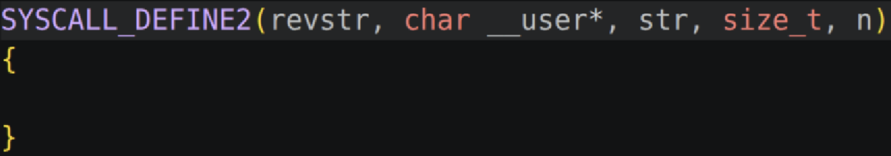
`SYSCALL_DEFINE2`: this function has two arguments, so write '2' after SYSCALL_DEFINE. 
And documentation says the argument should be present as (type, name) pair, so write it as above.

    `__user` 表示是指向 user space 的 pointer，不可隨意 dereference (即資料存在 user space)

2. string set up in the kernel:
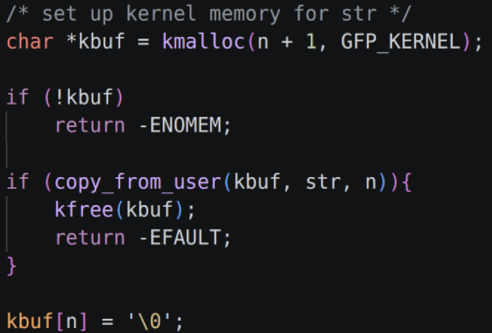
since `str` is located in user space, so we should copy them to the kernel space 
(first allocate memory space for `str` in the kernel, and use `copy_from_user()` to copy the content of `str` to the kernel space)

3. write data to kernel ring buffer (for easy debugging):
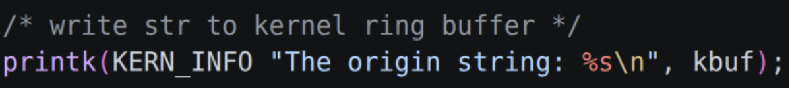

4. reverse `str`(or `kbuf`) using two pointer method:
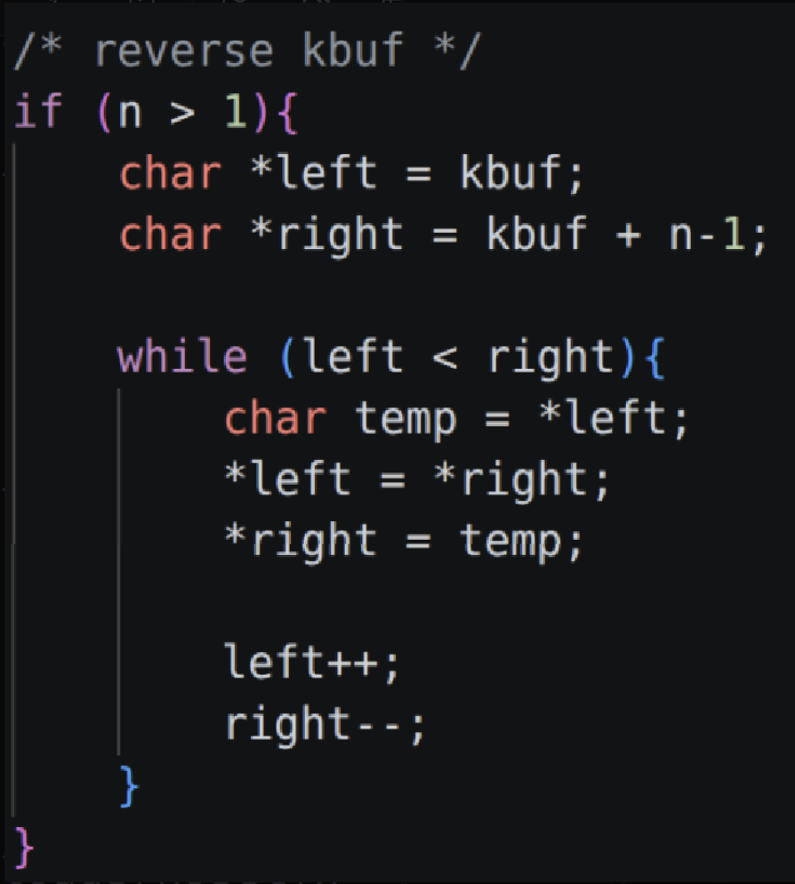

5. write the reversed `str`(or `kbuf`) to kernel ring buffer:
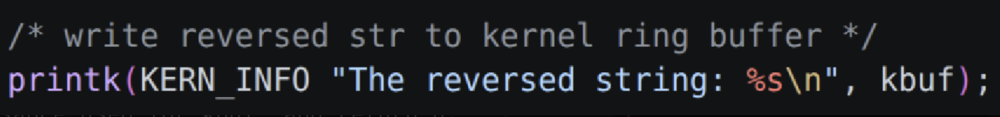

6. pass reversed `str` back to the kernel space using `copy_to_user()`:
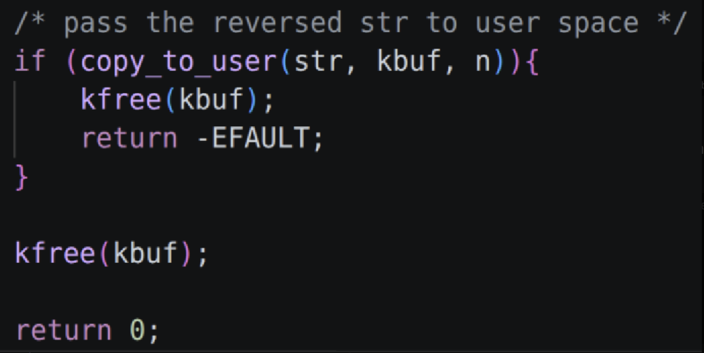 
finally, free the kernel memory sapce used for kbuf, and return 0.

## `sys_tempbuf.c`
1. Initialization:
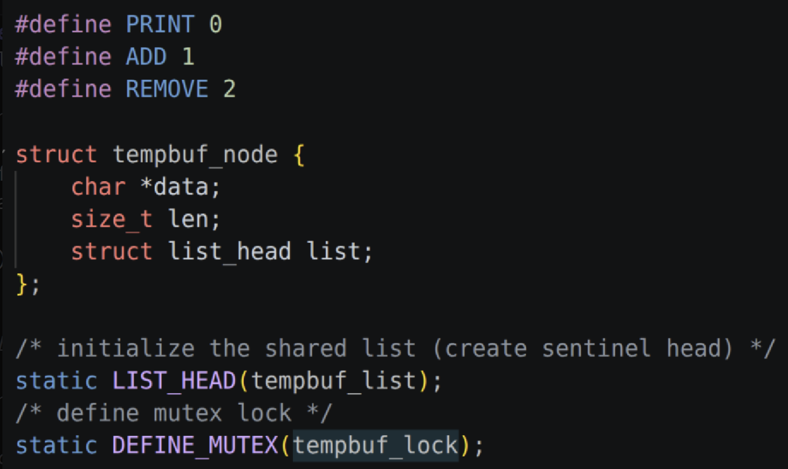
    :::info
    initializae the header node for node list (it will not be traversed)
    :::

2. `SYSCALL_DEFINE3`:
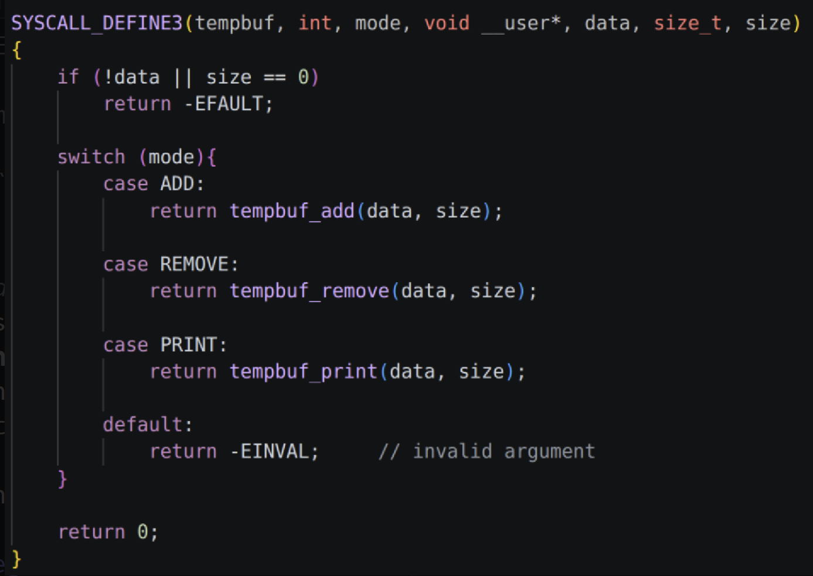
use `switch` `case` to identify the modes

3. `tempbuf_add()`:
    :::success
    **Flow concept**: 
    create a new node struct => place data into the node (node->data) => add the new node to the node list using `list_add_tail()`
    :::
    a. 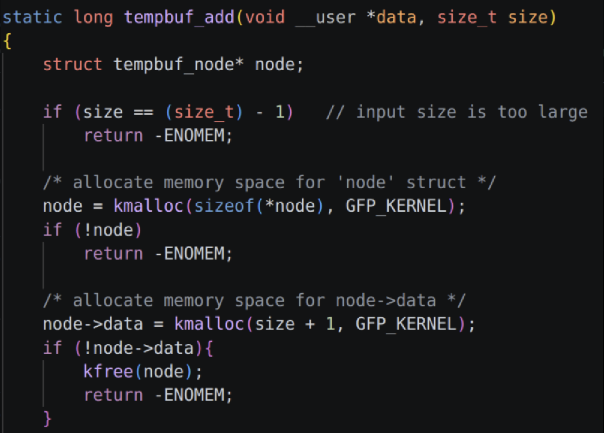
create a node struct and allocate the memory space in kernel

    b. 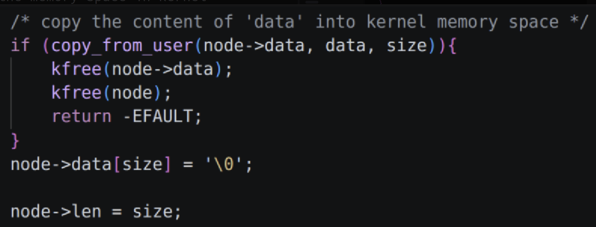
copy the data(str) into the node (from user space to kernel space) and handle the string termination sign

    c. 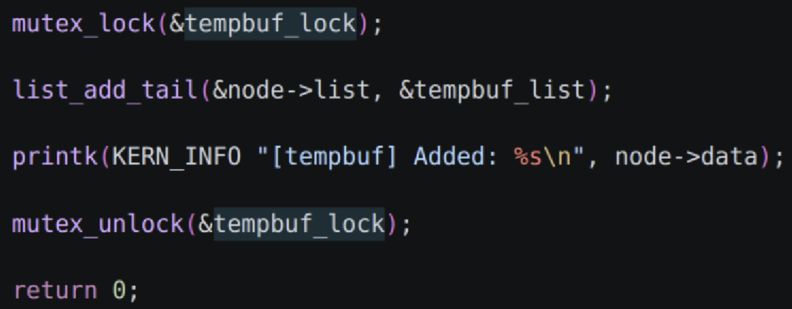
add the new node to the node list and then put the message into kernel ring buffer

4. `tempbuf_remove()`:
    :::success
    **Flow concept**:
    copy the target data into kernel space => traverse the node list to find the targeted node => if found, delete the node
    :::
    a. 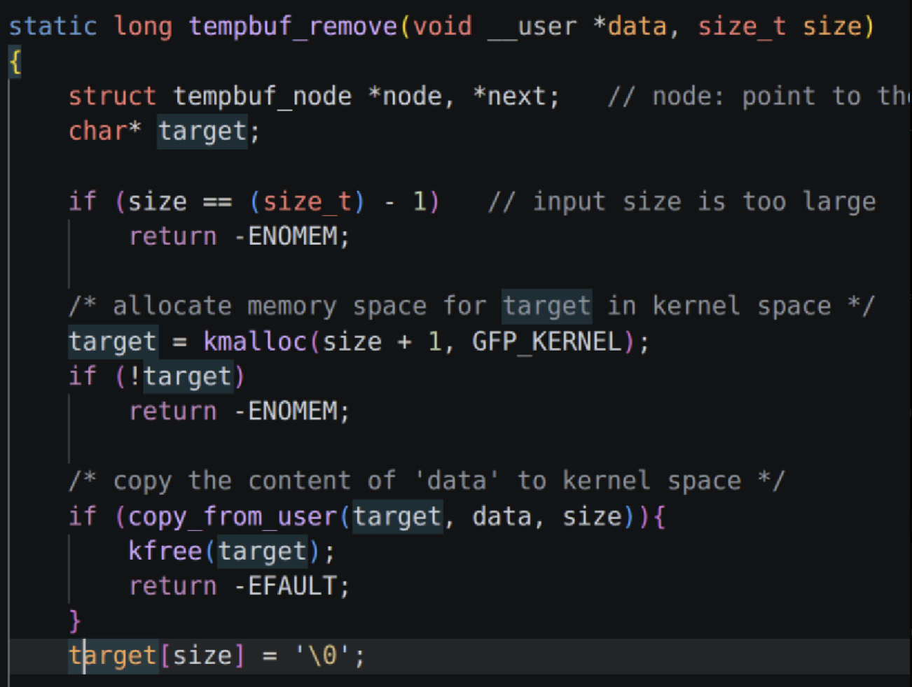
define `node` & `next` for traversing (the current node and the next node)

    copy the data from user space to kernel space

    b. 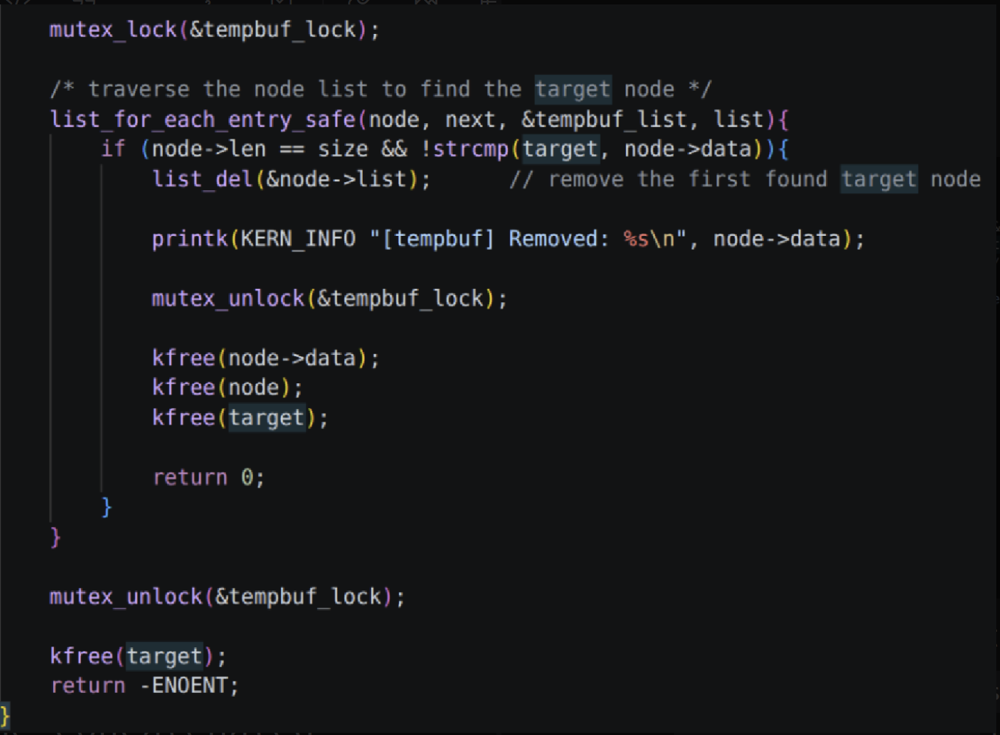
traverse the node list (using `list_for_each_entry_safe` to find all or `list_for_each_entry` to find one) and delete the target node (if found)

5. `tempbuf_print()`:
    :::success
    **Flow concept**:
    count the size that should be allocated to the concatenated string and allocate it => concate all the strings to `result` string => pass it back to user space and place it to kernel ring buffer
    :::
    a. 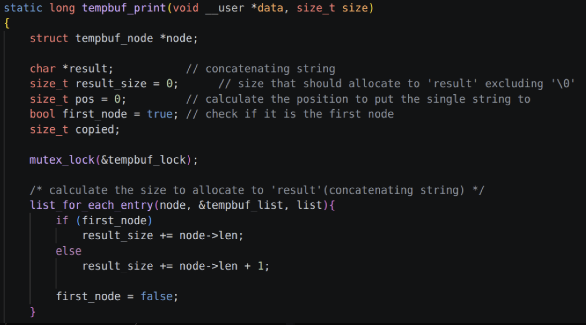
count the total size that should be allocated to `result` string

    b. 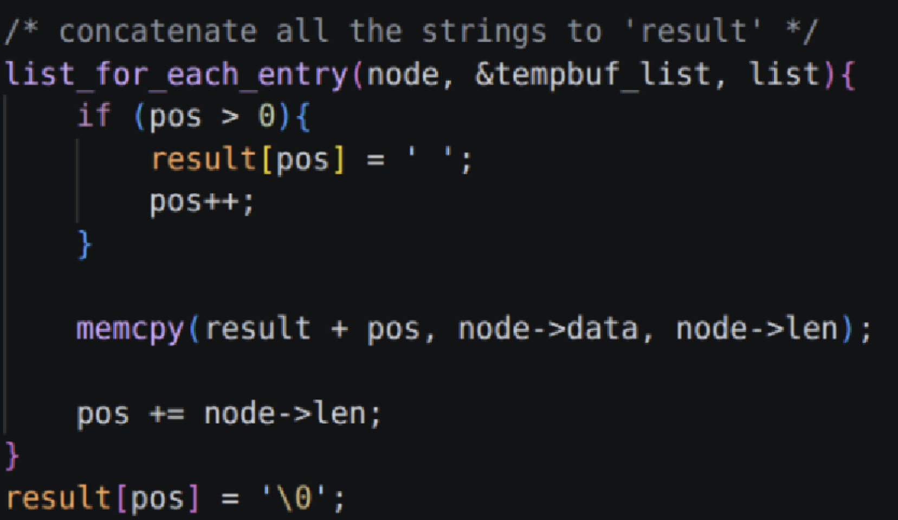
travrse each node and concate all to the tail of the result string (using `pos` variable)
    
    c. 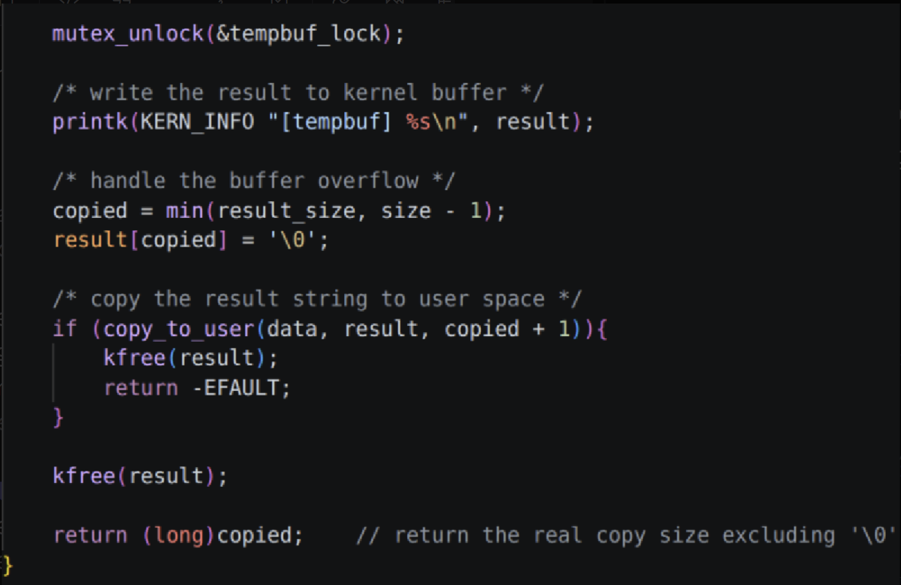
place the message into kernel ring buffer using `printk()` and send it back to user space using `copy_to_user()`
    
# Things optional to be done
* write makefile for compiling kernel and emulation
* write kconfig
